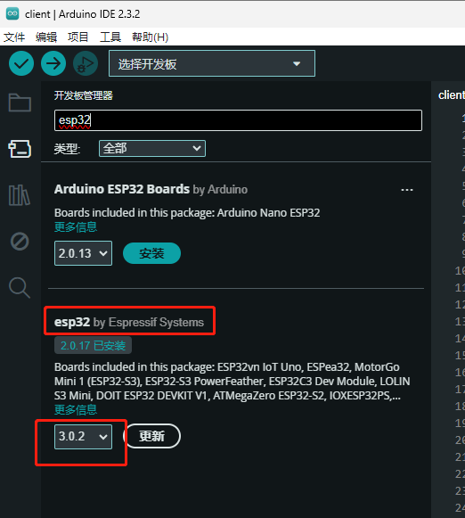

# ESP-AI  [](https://www.npmjs.com/package/esp-ai) [](https://www.npmjs.com/package/esp-ai)


<a href="./readme_english.md">English</a>
 
 
> 为你的开发板提供全套的AI对话方案，包括但不限于 `ESP32` 系列开发板的 `IAT+LLM+TTS` 集成方案。依赖式注入到项目，并不影响现有项目。

你只需要将讯飞、积灵、本地服务等平台提供`IAT`、`LLM`、`TTS`服务提供的`key`传给插件，即可运行服务，而不需考虑各个服务间的交互，也无需考虑开发板和服务间的交互，你仅需做好机器人~

本项目服务端代码基于 Nodejs，硬件代码基于 Arduino IDE。

开源不易，右上角点个 `Star` 支持一下下吧 ~

# 仅几行代码为您的机器人注入灵魂

下面分别展示在只需要对话的情况下，你需要写的`Node.js`和`Arduino`代码。


# 网站主页 & 文档教程
努力建设中...

# 升级日志
<a href="./version-log.md">升级日志</a>

# 交流群
QQ 交流群: 854445223

# 详细使用教程
[将硬件接入大语言模型(LLM)将变得如此简单~](https://juejin.cn/post/7384704245495234594)


# 案例视频
[bilibili](https://www.bilibili.com/video/BV1xS421o7hi/#reply1505985392)


# 必读

因为不同的平台提供的能力各有差异，所以可以根据需求为不同服务选择不同的提供平台。
如讯飞虽然支持`LLM`、`TTS`、`IAT`。但是他的`LLM`可能你并不喜欢，所以你可以在服务端将 `llm_server` 配置为其他平台的。

各平台提供的流式数据能力不一，所以部分平台只对接了部分功能。例如积灵目前只能对接 `LLM` ，语音识别等并不提供`wss`协议的流数据，所以不进行对接。当然平台支持后也会第一时间进行支持！

还有就是不要用源码方式运行，不管是客户端还是服务端都会随时升级。

**声明：本项目在非不得已情况下不会做出破坏性更新。**

# 怎么运行这个项目？

**简单三步，即可将一个智能助手运行起来。**

1. 安装服务端插件
2. 将插件引入你的项目中，配置好相关的`key`并运行
3. 将提供的客户端代码烧录到 `ESP32s3` 开发板中(需将/client/libraries 中的插件导入到IDE)

# 所需环境

1. nodejs >= v14.0.0 
2. Arduino IDE >= v2.x
3. Arduino IDE 中安装 esp 2.x 开发板（不能大于2.x）

4. 需将`/client/libraries` 中的插件导入到IDE插件中，默认位置在`C:\Users\用户名\Documents\Arduino\libraries`。

 
| 文件名 | 备注 |
| -------- | ------- |
| arduino-audio-tool      | 新版IDE可以直接搜索安装     |
| arduinoWebSockets      | 新版IDE可以直接搜索安装     | 
| esp-ai      | esp-ai 暂时不可搜索安装     | 
| xiao_ming_tong_xue_inferencing      | 离线语音识别模型  暂时不可搜索安装    |


# 运行前准备
1. 注册讯飞开放平台账号(其他平台见下文支持度，也支持豆包、百度等)
2. 获取讯飞开放平台账号的 appid 和 apikey 


# 运行服务端和客户端
1. 将 example/index.js、example/example.ino 这两个文件复制到本本地电脑中。
2. 进入你电脑中的 example/ 目录中。
3. 执行命令安装ESP-AI
```
# 或者使用：yarn add esp-ai
npm i esp-ai
```
1. 运行服务
```
# 生产环境中请使用 pm2 来运行服务以保证服务的可靠和性能。 
node ./index.js
```
1. 打开 `example.ino` 并且上传到开发板中。


# 客户端接线
## ESP32-s3 开发板
### INMP441(麦克风) 接线
| ESP32-s3 | INMP441 |
| -------- | ------- |
| 3v3      | VDD     |
| GND      | GND     |
| GND      | L/R     |
| 5        | WS      |
| 4        | SCK     |
| 6        | SD      |

### Max98357A(放大器) 接线
| ESP32-s3 | Max98357A |
| -------- | --------- |
| 3v3      | VDD       |
| GND      | GND       |
| 17       | LRC       |
| 16       | BCLK      |
| 15       | DIN       |

### 电位器(音量调节) 接线（可选，不接也行）
| ESP32-s3 | 电位器 |
| -------- | ------ |
| 3v3      | VDD    |
| GND      | GND    |
| OUT      | 34     |

### LED 接线（可选，不接也行）
| ESP32-s3 | LED  |
| -------- | ---- |
| GND      | GND  |
| 18       | 正极 |

# 支持的开发板

**✔️ 已支持**   **❗开发中**   **❌ 不支持**
 
| 开发板        | IAT | LLM | TTS | 离线唤醒 |
| ------------- | --- | --- | --- | -------- |
| ESP32-s3      | ✔️   | ✔️   | ✔️   | ✔️        |
| nodemcu-32    | ✔️   | ✔️   | ✔️   | ❌        |
| ESP32-xiao-s3 | ❗   | ❗   | ❗   | ✔️        |
| 增加中...     |


# 支持的平台
**✔️ 已支持**   **❗开发中**   **❌ 不支持** 

不同功能可以使用不同的服务商，比如服务中使用讯飞的TTS和阿里的LLM, 而不是只用讯飞的产品，只需要更改配置文件即可。

| 服务方           | IAT | LLM | TTS |
| ---------------- | --- | --- | --- |
| <a src="https://www.xfyun.cn/">讯飞</a>             | ✔️   | ✔️   | ✔️   |
| <a src="https://www.volcengine.com/">火山引擎(豆包等)</a> | ❗   |  ❗  | ✔️   |
| <a src="https://www.ttson.cn/">海豚配音</a> | ❗   |  ❗  | ❗  |
| <a src="https://dashscope.console.aliyun.com/"> 阿里积灵(千问等)</a> | ❗   | ✔️   | ❗   |
| chat GPT          | ❗   | ❗   | ❗   |
| 百度             | ❗   | ❗   | ❗   |
| 本地服务         | ❗   | ❗   | ❗   |
| 增加中...        |


# 离线唤醒方案
**✔️ 已支持**   **❗开发中**   **❌ 不支持**
 
| 方案         | 是否支持 | 模型开源仓库                                 |
| ------------ | -------- | -------------------------------------------- |
| Edge Impulse | ✔️        | https://studio.edgeimpulse.com/studio/422422 |
| ESP-SR       | ❗        | ❗                                            |
| 增加中...    |          |

 

# 实现原理步骤

INMP441(MIC) -> audio -> ESP32 -> wake-on-voice -> audio -> esp-ai -> IAT Server -> text -> esp-ai -> LLM -> reply -> esp-ai -> TTS -> esp-ai -> ESP32 -> max98357(loudspeaker)

待补充结构图

 
# 客户端配置项
```
#include <esp-ai.h>

ESP_AI esp_ai;
// [必  填] 是否调试模式， 会输出更多信息
bool debug = true;
// [必  填] wifi 配置： { wifi 账号， wifi 密码 }  注意：要用双引号！
ESP_AI_wifi_config wifi_config = { "oldwang", "oldwang520" };
// [必  填] 服务配置： { 服务IP， 服务端口 }
ESP_AI_server_config server_config = { "192.168.1.5", 8080 };
// [必  填] 离线唤醒方案：{ 方案, 识别阈值 }, "edge_impulse" | "diy"，为 "diy" 时可调用 esp_ai.wakeUp() 方法进行唤醒
ESP_AI_wake_up_config wake_up_config = { "edge_impulse", 0.7 };

// [可留空] 麦克风引脚配置：{ bck_io_num, ws_io_num, data_in_num }
ESP_AI_i2s_config_mic i2s_config_mic = {};
// [可留空] 扬声器引脚配置：{ bck_io_num, ws_io_num, data_in_num }
ESP_AI_i2s_config_speaker i2s_config_speaker = {};
// [可留空] 音量调节配置：{ 输入引脚，输入最大值(1024|4096)，默认音量(0-1) }
ESP_AI_volume_config volume_config = { 34, 4096, 0.5 };

// 收到指令后的回调，比如开灯、关灯，由服务端配置。
void on_command(char command_id, char data) {
  Serial.print("收到指令");
  Serial.println(command_id);
  Serial.println(data);
}

void setup() {
  Serial.begin(115200);
  // 开始运行 ESP-AI
  esp_ai.begin({ i2s_config_mic, i2s_config_speaker, wifi_config, server_config, wake_up_config, volume_config, debug });
  // wifi 测试代码
  // Serial.println(esp_ai.wifiIsConnected() ? "已连接" : "未连接");
  // Serial.println(esp_ai.localIP().c_str());
  // 用户指令监听
  esp_ai.onEvent(on_command);
}

void loop() {
  // 连接wifi后会返回 True
  if (!esp_ai.wifiIsConnected()) {
    return;
  } 
  esp_ai.loop();
}
```


# 服务端配置项
提供 `Typescript` 定义文件，`TS` 项目也可正常引用。

```
const espAi = require("esp-ai");
espAi({
    /**
     * 服务端口, 默认 8080
    */
    port: 8080,

    /**
     * 日志输出模式：0 不输出(线上模式)， 1 普通输出， 2 详细输出
    */
    devLog: 1,

    /**
     * 语音识别服务、TTS服务、LLM 服务的提供方, 默认为 xun_fei
     * @value xun_fei           讯飞的服务
     * @value dashscope         阿里-积灵
     * @value bai_du            百度的服务（预计 1.0 版本支持）
     * @value privatization     自己的服务（预计 1.0 版本支持）
    */
    iat_server: "xun_fei", 
    tts_server: "xun_fei", 
    llm_server: "xun_fei",
    // llm_server: "dashscope",

    /**
     * 不同的服务商需要配置对应的 key
     * 每个服务商配置不是完全一样的，具体请参考文档
    */
    api_key: {
        // 讯飞：https://console.xfyun.cn/services/iat  。打开网址后，右上角三个字段复制进来即可。
        xun_fei: {
            appid: "xxx",
            apiSecret: "ZjQwYxxxxxx",
            apiKey: "9cd65073xxxxx",
            // LLM 版本
            llm: "v3.5",
        },
        // 阿里云-积灵： https://dashscope.console.aliyun.com/apiKey
        // 积灵主要是提供llm（推荐使用这个llm服务）
        dashscope: {
            apiKey: "sk-xxxx",
            // LLM 版本
            llm: "qwen-turbo",
        },
        

        // 火山引擎（豆包等）：https://console.volcengine.com/speech/service/8?AppID=6359932705
        volcengine:{ 
            // 火山引擎的TTS与LLM使用不同的key，所以需要分别配置
            tts:{
                // 服务接口认证信息
                appid: "xxx",
                accessToken: "xxx",  
            },

            // 暂不支持 llm
            llm:{ 
                // 获取地址：https://console.volcengine.com/ark/region:ark+cn-beijing/endpoint?current=1&pageSize=10
                model: "ep-xxx",// 每个模型都有一个id
                // 获取地址：https://console.volcengine.com/ark/region:ark+cn-beijing/apiKey
                apiKey: "32dacfe4xxx",  
            }
        },
        
        // 海豚ai，适配中...
        ttson:{
            token: "ht-"
        },
    },

    /**
     * 意图表：当用户唤醒 小明同学 后，小明同学可以做下面的任务
    */
    intention: [
        {
            // 关键词
            key: ["帮我开灯", "开灯", "打开灯"],
            // 向客户端发送的指令
            instruct: "device_open_001",
            message: "开啦！还有什么需要帮助的吗？"
        },
        {
            // 关键词
            key: ["帮我关灯", "关灯", "关闭灯"],
            // 向客户端发送的指令
            instruct: "device_close_001",
            message: "关啦！还有什么需要帮助的吗？"
        },
        {
            // 关键词
            key: ["退下吧", "退下"],
            // 内置的睡眠指令
            instruct: "__sleep__",
            message: "我先退下了，有需要再叫我。"
        }
    ],

    /**
     * 初始化LLM时的提示
    */
    llm_init_messages: [
        {
            "role": "system",
            "content": "你是一个非常厉害的智能助手！你的名字叫小明同学。"
        },
        {
            "role": "system",
            "content": "你擅长用精简的句子来回答用户的问题。每次回答用户的问题最多都不会超过50字。除非用户指定多少字。"
        },
    ],

    /**
     * 被唤醒后的回复
    */
    f_reply: "小明在的",

    /**
     * 休息时的回复
    */
    sleep_reply: "我先退下了，有需要再叫我。",

    /**
     * llm 参数控制, 可以设置温度等
    */
    llm_params_set: (params) => {
        // 千问top_p、top_k ...
        // params.top_p = 0.5;     

        // 讯飞 temperature ...
        // params.parameter.chat.temperature = 0.4;
        // params.parameter.chat.max_tokens = 100;

        // 改完后一定要返回出去
        return params;
    },

    
    /**
     * tts 参数控制, 可以设置说话人、音量、语速等
     * 不同服务要求的参数格式和属性名字不同，根据下面属性进行配置
    */
    tts_params_set: (params) => {

        /** 阿里积灵 **/
        // 说话人列表见：https://console.xfyun.cn/services/tts  
        // params.model = : "sambert-zhimiao-emo-v1" 

        /** 讯飞 **/
        // 说话人列表见：https://help.aliyun.com/zh/dashscope/developer-reference/model-list-old-version?spm=a2c4g.11186623.0.0.5fbe490eBdtzX0
        // params.vcn = "aisbabyxu";

        /** 火山引擎 **/
        // 说话人列表见：https://www.volcengine.com/docs/6561/97465
        // params.voice_type = "BV051_streaming"
        // params.voice_type = "BV021_streaming"
        // params.voice_type = "BV506_streaming"
        
        /** 海豚配音 **/
        // token注册：https://www.ttson.cn/ 
        // 说话人列表见：https://github.com/wangzongming/esp-ai/tree/master/src/functions/tts/ttson/角色列表.yaml
        // params.voice_id = 2115;

        // 改完后一定要返回出去
        return params;
    },


    /**
     * 新设备连接服务的回调 
     * @param {string} device_id 设备id
     * @param {WebSocket} ws 连接句柄，可使用 ws.send() 发送数据
    */
    onDeviceConnect({ device_id, ws }) { },

    /**
     * iat 回调 
     * @param {string} device_id 设备id
     * @param {string} text 语音转的文字 
    */
    onIATcb({ device_id, text }) { },

    /**
     * tts 回调 
     * @param {string} device_id 设备id
     * @param {Buffer} is_over  是否完毕
     * @param {Buffer} audio    音频流
    */
    onTTScb({ device_id, is_over, audio }) { },

    /**
     * llm 回调 
     * @param {string} device_id 设备id
     * @param {string} text 大语言模型推理出来的文本片段 
     * @param {boolean} is_over 是否回答完毕 
     * @param {object[]} llm_historys 对话历史 
     * 
    */
    onLLMcb({ device_id, text, is_over, llm_historys }) { },
});
```

# 其他说明
目前语音唤醒由于训练样本不多，准确度并不高，会持续优化。

欢迎 pr 一起共建~。
