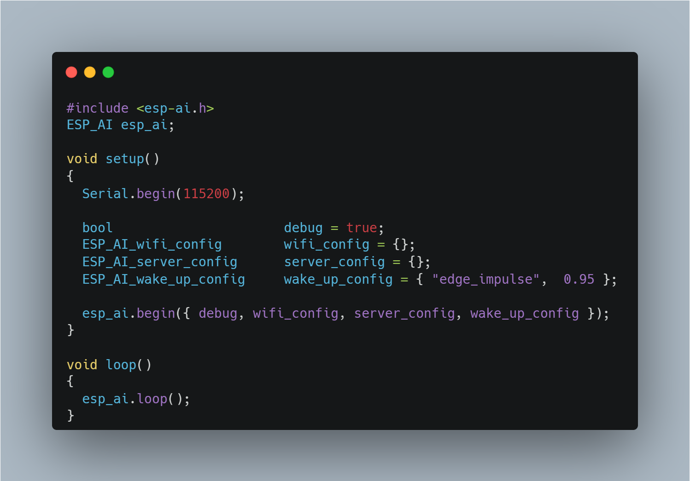
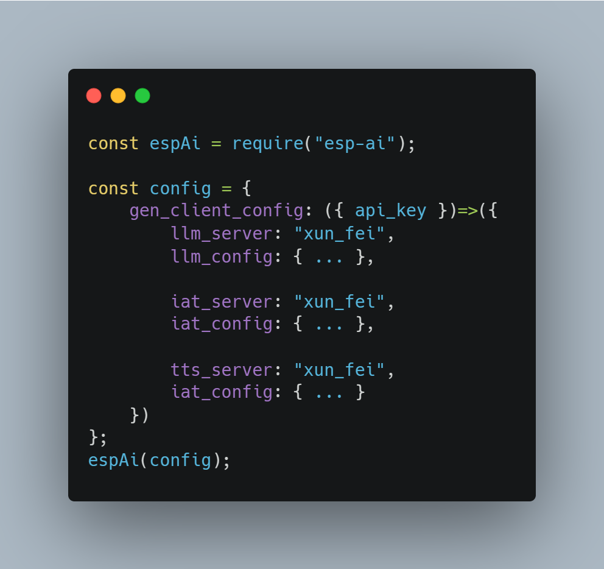

<div align="center"> 
<a name="readme-top"></a>

<div style="background:#fff;border-radius: 12px;width:300px;">
   
</div>

<h1>ESP-AI</h1>

ハードウェアがAIに接続するための最も簡単で低コストなソリューション<br/>The simplest and lowest cost solution for any item to access AI


[![NPM version][npm-image]][npm-url] 
[![NPM downloads][download-image]][download-url]
[![][bundlephobia-image]][bundlephobia-url] 

[Changelog](https://espai.fun/change-logs.html) · 
[中文文档](https://espai.fun/) · 
[English Docs](https://espai.fun/en)


[npm-image]: https://img.shields.io/npm/v/esp-ai.svg?style=flat-square
[npm-url]: https://npmjs.org/package/esp-ai
[download-url]: https://npmjs.org/package/esp-ai
[bundlephobia-image]: https://badgen.net/bundlephobia/minzip/esp-ai?style=flat-square
[download-image]: https://img.shields.io/npm/dm/esp-ai.svg?style=flat
[bundlephobia-url]: https://bundlephobia.com/package/esp-ai 
   

<div style="background:#fff;border-radius: 12px;">

</div>


</div>

<h2>
<a href="./readme_zh.md">👉简体中文</a>
</h2>

> 開発ボードに完全なAI対話ソリューションを提供します。これには、`ESP32`シリーズ開発ボードの`IAT(ASR)+LLM+TTS`統合ソリューションが含まれますが、これに限定されません。既存のプロジェクトに影響を与えずに、依存関係としてプロジェクトに注入されます。

ロボットの対話機能を開発するためには、`IAT(ASR)`、`LLM`、`TTS`サービスを準備するだけで、残りは`ESP-AI`に任せてください。

このプロジェクトのサーバー側コードは`Node.js`に基づいており、ハードウェアコードは`Arduino`/`IDF`に基づいています。

オープンソースは簡単ではありません。右上の`Star`ボタンをクリックしてサポートを示してください~

# 🖥 ウェブサイト

- [中文网站](https://espai.fun/)
- [English](https://espai.fun/en)


# 🖥 オープンプラットフォーム 

ESP-AIに基づいて、企業や個人にエンドサービスと管理サービスを提供するプラットフォームです。[オープンプラットフォームを訪問](https://dev.espai.fun/)。
無料のASR（自動音声認識）、TTS（テキスト読み上げ）、LLM（大規模言語モデル）サービスを提供しています。このプラット���ォームでは、15秒の音声クリップでカスタム音声をクローンできます。

# ✨ 特徴

- ✔️ カスタマイズ可能なオフラインウェイクワードと複数の内蔵ウェイクアップ方法（音声、ボタン、シリアルポート、Tianwen ASRPro）
- ✔️ 完全な会話チェーン：IAT（ASR）➡️ LLM/RAG ➡️ TTS
- ✔️ TTS/LLMの高速応答アルゴリズム、サービスコストを考慮しながら最速の応答時間を提供
- ✔️ 会話の中断をサポート
- ✔️ ユーザーコマンドの認識（家電制御、歌唱など）とコンテキストに基づいた動的応答
- ✔️ 設定可能
- ✔️ プラグインベースで、任意のLLM/TTS/IATをプラグインで統合可能
- ✔️ サービスとクライアントの一対多の関係、各クライアント（ハードウェア）に独立した設定を提供
- ✔️ 接続は認証をサポート
- ✔️ フルチェーンのストリーミングデータインタラクション
- ✔️ 開発者プラットフォームが提供：無料サービス、ビジュアル設定など
- ✔️ クライアント設定のウェブページを提供
- ✔️ 高い同時接続シナリオに簡単に対応（負荷分散のためにNginxが必要）
- ✔️ すぐに使える

# 🧐 次のステップ

- [ ] 🤔 内蔵オフラインウェイクアップの精度向上（現在はTianwen ASRProの使用を推奨） 
- [ ] 🤔 オンラインウェイクワード生成 
- [ ] 🤔 他の言語でのプラグイン開発（Node.jsに依存しないプラグイン開発） 

# 📦 インストール


### サーバー
```bash
docker run -itd -p 8088:8088 -v /esp-ai-server/index.js:/server/index.js --name esp-ai-server registry.cn-shanghai.aliyuncs.com/xiaomingio/esp-ai:1.0.0
```
### クライアント
リリースページから依存関係をダウンロードし、開発ボードに書き込んでください。詳細は：[クライアントインストール](https://espai.fun/start.html#%E5%AE%A2%E6%88%B7%E7%AB%AF)

# 🔨 数行のコードでロボットに魂を注入

以下は、対話機能のみが必要な場合に書く必要がある`Node.js`と`Arduino`のコードです。

<!--  -->
<!--  -->


# 🏪 ディスカッショングループ
QQディスカッショングループ: 854445223
 
# 🎥 ケーススタディビデオ
[bilibili](https://www.bilibili.com/video/BV1gE421w7Dw/?share_source=copy_web&vd_source=041c9610a29750f498de1bafe953086b)
 

## 🤝 貢献 [](http://makeapullrequest.com)

一緒により良い`esp-ai`を作りましょう。

皆さんの貢献を心から歓迎します。アイデアを[Pull Requests](https://github.com/wangzongming/esp-ai/pulls)や[GitHub Issues](https://github.com/wangzongming/esp-ai//issues)で共有してください。
 
<table>
<tr>
  <td> 
<a href="https://next.ossinsight.io/widgets/official/compose-recent-top-contributors?repo_id=820274347" target="_blank" style="display: block" align="center">
  <picture>
    <source media="(prefers-color-scheme: dark)" srcset="https://next.ossinsight.io/widgets/official/compose-recent-top-contributors/thumbnail.png?repo_id=820274347&image_size=auto&color_scheme=dark" width="280" height="auto">
    
  </picture>
</a>
 
  </td>
  <td rowspan="2"> 
    <a href="https://next.ossinsight.io/widgets/official/compose-last-28-days-stats?repo_id=820274347" target="_blank" style="display: block" align="center">
    <picture>
        <source media="(prefers-color-scheme: dark)" srcset="https://next.ossinsight.io/widgets/official/compose-last-28-days-stats/thumbnail.png?repo_id=820274347&image_size=auto&color_scheme=dark" width="655" height="auto">
        
    </picture>
    </a> 
  </td>
</tr>
<tr>
  <td> 
<a href="https://next.ossinsight.io/widgets/official/compose-recent-active-contributors?repo_id=820274347&limit=30" target="_blank" style="display: block" align="center">
  <picture>
    <source media="(prefers-color-scheme: dark)" srcset="https://next.ossinsight.io/widgets/official/compose-recent-active-contributors/thumbnail.png?repo_id=820274347&limit=30&image_size=auto&color_scheme=dark" width="273" height="auto">
    
  </picture>
</a> 
  </td>
</tr>
</table>


# 🌍 Starの地理的分布
<a href="https://next.ossinsight.io/widgets/official/analyze-repo-stars-map?repo_id=820274347&activity=stars" target="_blank" style="display: block" align="center">
  <picture>
    <source media="(prefers-color-scheme: dark)" srcset="https://next.ossinsight.io/widgets/official/analyze-repo-stars-map/thumbnail.png?repo_id=820274347&activity=stars&image_size=auto&color_scheme=dark" width="721" height="auto">
    
  </picture>
</a> 


# 引用
このプロジェクトがあなたの研究に役立った場合、私たちを引用してください：

    @software{ESP-AI,
        title        = {{ESP-AI}},
        author       = {小明IO},
        year         = 2024,
        journal      = {GitHub repository},
        publisher    = {GitHub},
        howpublished = {\url{https://github.com/wangzongming/esp-ai}}
    }
