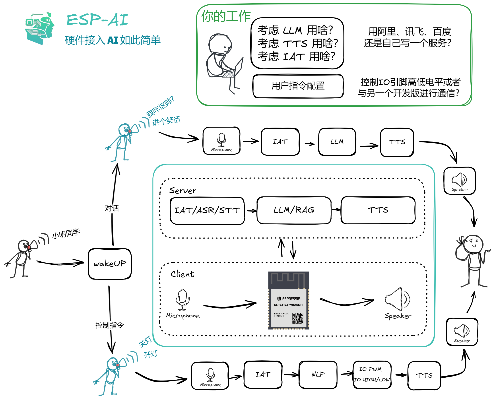

# ESP-AI   

<a href="./readme_english.md">English</a>
 
 
> 为你的开发板提供全套的AI对话方案，包括但不限于 `ESP32` 系列开发板的 `IAT(ASR)+LLM+TTS` 集成方案。依赖式注入到项目，不影响现有项目。

对于开发机器人的对话功能，您仅需准备好 `IAT(ASR)`、`LLM`、`TTS` 服务，其他的事情交给 `ESP-AI`。

本项目服务端代码基于 Nodejs，硬件代码基于 Arduino IDE。

开源不易，右上角点个 `Star` 支持一下下吧 ~

# 网站主页 

- [中文文档](https://xiaomingio.top/esp-ai/)
- [English](https://xiaomingio.top/esp-ai/en)

# 特性

- [x] 可定制的离线语音唤醒
- [x] IAT(ASR) ➡️ LLM/RAG ➡️ TTS
- [x] 用户指令识别(家电控制、唱歌等)
- [x] 配置化
- [x] 插件化
- [x] 服务与客户端为一对多关系
- [x] 服务端鉴权 
- [x] 流式数据交互 
- [x] 开箱即用

# 下一步 

- [ ] 提供无代码接入方案
- [ ] 用户意图推理过程加入AI（如： 帮我关灯、快开灯，都将识别为: "开灯" 指令）
- [ ] 提供免费服务与收费服务
- [ ] 唤醒词在线生成
- [ ] 其他语言编写插件的方案，（避免只能使用nodejs进行开发插件）
- [ ] 提供专用开发板（避免当前的复杂接线）

# 仅几行代码为您的机器人注入灵魂

下面分别展示在只需要对话的情况下，你需要写的`Node.js`和`Arduino`代码。

# 交流群
QQ 交流群: 854445223

# 详细使用教程
[将硬件接入大语言模型(LLM)将变得如此简单~](https://juejin.cn/post/7384704245495234594)

# 案例视频
[bilibili](https://www.bilibili.com/video/BV1xS421o7hi/#reply1505985392)
